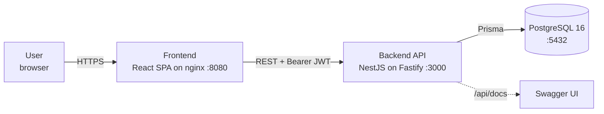
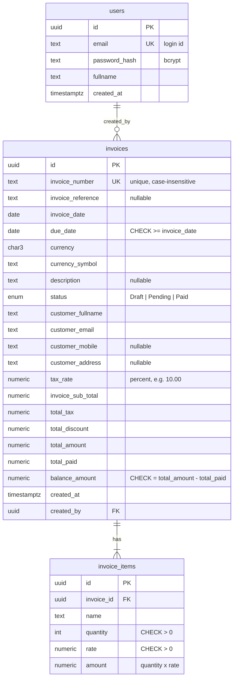
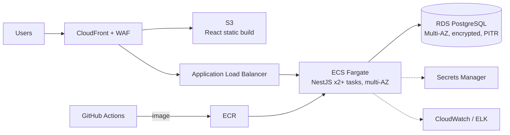

# SimpleInvoice — Architecture

> Scope: 101 Digital Full-Stack Assessment (v2.3.1). This document explains **what** we built, **why**
> each decision was made, and **how** it would evolve into a production banking/payments system.

## 1. System context



| Layer | Tech | Why |
|---|---|---|
| Frontend | React 19 + TypeScript, Vite, MUI, React Query, Zustand, React Hook Form + Zod | MUI gives responsive table/form/feedback primitives; React Query owns server state (cache, loading, retries); Zustand holds the tiny client state (session). |
| Backend | NestJS 11 on the **Fastify** adapter, class-validator, @nestjs/jwt, @nestjs/swagger | Modular DI architecture; Fastify is faster than Express and ships a structured (pino) logger. |
| Persistence | PostgreSQL 16 + Prisma 6 | Relational integrity (unique/check constraints), typed queries, versioned SQL migrations. |
| Packaging | Docker Compose (db → backend → frontend) | One command from zero: migrations and seed run automatically. |

**Repo layout:** monorepo — `backend/`, `frontend/`, `docs/`, `docker-compose.yml`. One clone, one review.

## 2. Backend module design (modular monolith)

```
backend/src
├── main.ts                  # bootstrap: Fastify, helmet, CORS, ValidationPipe, Swagger, shutdown hooks
├── app.module.ts
├── config/                  # env schema, validated at startup (fail fast)
├── common/                  # global exception filter, @Public() decorator, shared DTOs, date utils
├── database/                # PrismaService + seed/
├── auth/                    # POST /auth/login, GET /auth/me, global JWT guard
├── users/                   # user lookup
├── invoices/
│   ├── domain/              # PURE functions: totals calculator, status derivation, currency map
│   ├── dto/                 # request/response contracts (validation + Swagger)
│   ├── invoices.controller.ts
│   ├── invoices.service.ts  # orchestration: validation → calculate → persist → map
│   └── invoice-query.builder.ts  # list filters → Prisma where/orderBy
└── health/                  # GET /health (DB ping) for container probes
```

Rule of thumb: **business rules live in `invoices/domain` as pure functions** with no Nest/Prisma
imports, so they are trivially unit-testable and reusable (e.g. by a future payments service).

Modules talk only through exported services. Splitting `invoices` into its own service later is a
deployment decision, not a rewrite (see §9).

## 3. Data model



### Decisions

| Decision | Choice | Reason |
|---|---|---|
| Customer storage | **Embedded columns on `invoices`** | An issued invoice must keep the customer details *as they were at issue time* (a legal document snapshot). Also keeps search a single-table query. A `customers` master table is a roadmap item. |
| Line items | Separate `invoice_items` table | Spec: exactly one item now, model supports many later. |
| Money | `NUMERIC(18,2)` + Decimal arithmetic (never JS floats) | `0.1 + 0.2 !== 0.3`. Every amount is rounded **half-up to the currency's minor units**: 2 decimals for AUD/USD/GBP/SGD/EUR, **0 for VND** (ISO 4217). |
| Dates | `DATE` columns, `YYYY-MM-DD` strings end-to-end | Invoice/due dates are calendar dates, not instants — avoids timezone off-by-one bugs. |
| `tax_rate` column | **Added** (not in reference model) | Otherwise the tax % the user entered is lost and totals can't be audited/recomputed. |
| Stored totals | Persisted, guarded by CHECK constraints | Fast list sort by `total_amount`; DB guarantees `balance = total - paid` can never drift. |
| Status | Postgres enum `Draft/Pending/Paid` only | **Overdue is never stored** (spec §2.3.2) — derived at read time. |

### Constraints & indexes

| Object | Purpose |
|---|---|
| `UNIQUE (lower(invoice_number))` | Uniqueness enforced by the DB, case-insensitive (`inv-1` ≡ `INV-1`). |
| `CHECK due_date >= invoice_date` | Last line of defence behind DTO + service validation. |
| `CHECK quantity > 0`, `rate > 0`, amounts `>= 0`, `balance = total - paid` | Data integrity independent of application code. |
| B-tree on `invoice_date`, `due_date`, `total_amount`, `created_at` | Sortable columns. |
| B-tree on `(status, due_date)` | Status filters (incl. derived Overdue) are `status + due_date` predicates. |
| GIN `pg_trgm` on `invoice_number`, `customer_fullname` | `ILIKE '%keyword%'` can use an index instead of a full scan. |

## 4. API contract

Swagger UI: **`/api/docs`** (JSON: `/api/docs-json`; switch off with `SWAGGER_ENABLED=false`). All routes except login/health require `Authorization: Bearer <jwt>`.

| Method | Path | Auth | Success | Errors |
|---|---|---|---|---|
| POST | `/auth/login` | ✗ | 200 `{ accessToken, tokenType, expiresIn, user }` | 400 validation, 401 invalid credentials, 429 rate-limited |
| GET | `/auth/me` | ✓ | 200 user profile | 401 |
| GET | `/invoices` | ✓ | 200 `{ data, paging: { page, pageSize, total } }` | 400, 401 |
| GET | `/invoices/:id` | ✓ | 200 invoice detail with `customer` + `items` | 400 (not a UUID), 401, 404 |
| POST | `/invoices` | ✓ | 201 created invoice | 400, 401, 409 duplicate invoice number |
| GET | `/health` | ✗ | 200 `{ status: "ok" }` | 503 DB down |

### `GET /invoices` query parameters

| Param | Rules | Default |
|---|---|---|
| `page` | int ≥ 1 | 1 |
| `pageSize` | int 1–100 (capped to protect the DB) | 10 |
| `sortBy` | `invoiceDate` \| `dueDate` \| `totalAmount` | `createdAt` (newest first) |
| `ordering` | `ASC` \| `DESC` (case-insensitive) | `DESC` |
| `status` | `Draft` \| `Pending` \| `Paid` \| `Overdue` | — |
| `keyword` | partial, case-insensitive on invoice number **or** customer name | — |
| `fromDate` / `toDate` | `YYYY-MM-DD`, applied to **invoiceDate**, inclusive; `fromDate ≤ toDate` | — |

A stable tie-breaker (`id`) is always appended to `ORDER BY` so rows never jump between pages.

### Error shape (every error, via a global exception filter)

```json
{ "statusCode": 400, "message": ["dueDate must be on or after invoiceDate"], "error": "Bad Request" }
{ "statusCode": 404, "message": "Invoice not found", "error": "Not Found" }
```

Unknown errors return a generic 500 (details are logged server-side, never leaked).

## 5. Business rules

### Totals (server-side only)

```
subTotal      = quantity × rate
taxAmount     = round_half_up(subTotal × taxRate / 100, minorUnits)   # 2 dp; 0 for VND
totalAmount   = subTotal + taxAmount − discount
balanceAmount = totalAmount − totalPaid        (totalPaid = 0 for new invoices)
```

Extra guard: `discount ≤ subTotal + taxAmount` — an invoice can never have a negative total.

### Overdue derivation

```
if status != Paid AND dueDate < today  → "Overdue"
else                                   → persisted status
```

* "today" is evaluated in `APP_TIMEZONE` (default `Asia/Singapore`), so the answer doesn't depend on the server clock's zone.
* A due date **equal to today is not overdue**.
* Per the literal rule, a **Draft** can also become Overdue.

Because Overdue is derived, filtering must translate each status into SQL so that counts and
pagination stay correct:

| Filter | SQL predicate |
|---|---|
| `Overdue` | `status <> 'Paid' AND due_date < :today` |
| `Pending` | `status = 'Pending' AND due_date >= :today` |
| `Draft` | `status = 'Draft' AND due_date >= :today` |
| `Paid` | `status = 'Paid'` |

### Create invoice

* Status is always `Draft` (clients cannot set it — unknown fields are rejected).
* `currencySymbol` is derived server-side from `currency` (supported: AUD, USD, GBP, SGD, EUR, VND).
* Amounts must fit the currency's **minor units**: `1000.50 VND` is rejected ("must be a whole number for VND"), and tax on VND invoices is rounded to whole dong.
* Duplicate invoice number → **409 Conflict** (detected from the DB unique violation, so it is race-safe).

## 6. Security

| Concern | Implementation |
|---|---|
| Passwords | bcrypt (cost 10). Login errors are generic ("Invalid email or password"); a dummy hash is compared when the user doesn't exist to reduce timing-based user enumeration. |
| Tokens | HS256 JWT, `sub` = user id. Expiry `JWT_EXPIRES_IN` seconds (default **3600**). Secret only from env; app refuses to start without it. |
| Route protection | A **global** JWT guard (secure by default); only `@Public()` routes (login, health) opt out. |
| Client storage | Token kept in `sessionStorage` (cleared when the tab closes) + in-memory store. Any 401 → session cleared and redirect to `/login`. Trade-off vs httpOnly cookie discussed in §9. |
| Input | Global `ValidationPipe` with `whitelist` + `forbidNonWhitelisted` + `transform`. |
| Transport/headers | `@fastify/helmet` on the API; security headers in the frontend nginx; CORS restricted to `CORS_ORIGIN`. |
| Brute force | `/auth/login` rate-limited (configurable, default 10 req/min per IP). |

## 7. Frontend design

```
frontend/src
├── api/          # axios client (auth header + 401 interceptor), typed endpoint functions
├── stores/       # Zustand auth store (persisted to sessionStorage)
├── features/
│   ├── auth/     # LoginPage, RequireAuth route guard
│   └── invoices/ # List (table on desktop / cards on mobile), Detail, Create form, hooks
├── components/   # AppLayout, shared UI
└── lib/          # money/date formatting
```

* **URL is the source of truth for list state** (`?keyword=&status=&sortBy=&ordering=&page=&pageSize=`):
  refresh, back button and sharing a link all work.
* Search input is debounced (400 ms) to avoid a request per keystroke.
* Form validation mirrors the backend rules (Zod) for instant feedback; the **backend remains the authority**
  (totals are never computed for persistence on the client).

## 8. Testing strategy

| Level | Tooling | What |
|---|---|---|
| Backend unit | Jest | Totals calculator, Overdue derivation, due-date validator, unique-number → 409 mapping, list query builder, auth service |
| Backend e2e | Jest + Supertest + **Testcontainers** (real Postgres, real seed data) | Full workflow (login → create → list → detail); **invariants** that must hold for any data: status filters partition the set, paging visits each row exactly once, sort order, inclusive date bounds, list ≡ detail; token attacks (forged, expired, `alg:none`); 400/401/404/409 shapes |
| Frontend unit | Vitest + React Testing Library | Login form validation & flow, route guard redirect, list rendering/filters/past-the-end page, create-form validation & server defaults, HTTP client interceptors |
| Browser smoke | Playwright against the running Docker stack (also in CI) | One end-to-end flow through the real UI, API and database: sign in via redirect → create → search → detail totals → sign out |

## 9. Production deployment (target, not built for the assessment)

What is **already production-shaped** in the code: multi-stage non-root Docker images, env validation
(fail fast), `prisma migrate deploy` as a separate step, `/health` probe with DB check, structured JSON
logs with request IDs (`x-request-id`), graceful shutdown, CI pipeline.

Target on AWS (ap-southeast-1, Singapore):



* **Pipeline:** PR → lint/test/build → image to ECR → run `prisma migrate deploy` as a one-off task → blue/green deploy.
* **Secrets:** JWT secret + DB credentials from Secrets Manager, rotated; no secrets in images.
* **Edge:** WAF rate limiting + managed rules in front of the API; TLS everywhere.
* **Auth evolution:** move the frontend behind a **BFF** holding tokens in httpOnly cookies, then to
  **OIDC Authorization Code + PKCE** (e.g. Keycloak/Cognito) with MFA — the BFF is the recommended shape for that.
* **Data:** automated backups + PITR, read replica for list/search traffic.

## 10. Roadmap — banking & payments lens

SimpleInvoice records what is **owed**. A production system also has to **collect** the money, and payment flows run into failure modes a CRUD app never sees. The roadmap follows five invariants from payment-systems practice:

1. Money is never moved twice.
2. Every journal entry balances.
3. An **unknown** outcome is not a failure.
4. A cache is never the financial authority.
5. A failing notification or analytics job never reverses money.

### 10.1 Money representation

| Today (assessment) | Production-grade |
|---|---|
| Amounts leave the API as **JSON numbers**. They are exact only below about 90 trillion in cents, so inputs are capped (quantity ≤ 100,000, rate ≤ 100,000,000). | Amounts travel as **strings** (`"2180.00"`), are stored as **integer minor units** (`bigint`) and are computed with BigInt/Decimal. The caps become unnecessary and no client can lose a cent while parsing. |
| Currency scale from a fixed table (2 decimals; **0 for VND**) | Full ISO 4217 table (JPY 0, KWD 3…) with rounding rules per currency. An **FX rate snapshot** at issue time for multi-currency reporting. |
| The list can sort amounts **across currencies** | Totals, sorting and control totals only **within one currency**, or converted with a recorded FX rate. Never add SGD to VND. |
| Single flat tax % | Tax rules per jurisdiction (SG GST 9%, AU GST 10%), tax-inclusive/exclusive pricing. |

### 10.2 Payments and ledger

| Today | Production-grade |
|---|---|
| `totalPaid` is a mutable number | **Append-only `payments` table + double-entry journal**: receiving 100 debits Cash and credits Accounts Receivable, and every posting sums to zero. `totalPaid` is derived. |
| No corrections | Mistakes are fixed with **reversal / adjustment entries linked to the original**, never by editing or deleting history. |
| One `status` field | **Separate state dimensions**: document (Draft → Issued → Void), collection (Unpaid → Partially paid → Paid), settlement (Pending → Settled). |
| No payment evidence | "Paid" only on **final** evidence. A PSP "accepted" is only an ACK: acknowledgement ≠ finality ≠ settlement. |
| No returns | A chargeback or return after "Paid" is a **new linked workflow** (credit note + reversing entries with reason and evidence), not a rollback. |

### 10.3 Reliability

| Today | Production-grade |
|---|---|
| The invoice number acts as a business key: a retry after a timeout gets **409** | An **`Idempotency-Key`** header with a stored request hash. Same key + same payload returns the **original 201 response**; same key + different payload returns 422. Claimed in the same transaction as the insert. |
| No events | A **transactional outbox**: the event row commits with the invoice/payment, and a worker publishes it to Kafka (`invoice.issued`, `payment.posted`) for audit, notifications and dunning. |
| No webhooks | An **inbox** table: each PSP callback is verified, deduplicated **in the same transaction** as its effect, and applied through **transition guards**, so a late "pending" never overwrites "paid". Kafka's "exactly-once" doesn't extend to our database or external APIs. |
| No concurrency control | **Optimistic locking** (`version` column) for concurrent payment postings. External calls (PSP, risk checks) run **outside** DB transactions, and a timeout is recorded as `UNKNOWN` and re-queried, never treated as a failure. |

### 10.4 Reconciliation

| Today | Production-grade |
|---|---|
| None | Daily **two-way matching** of bank statements (ISO 20022 camt.053) and PSP reports against invoices/payments. Classes: missing on either side, amount/currency mismatch, duplicate. |
| — | Verify the file first (source, signature, count and **control total per currency**, complete period) before matching, so a partial file doesn't create thousands of false "missing" items. Keep the raw files for audit. |
| — | Exceptions go to an **investigation queue**; fixes are approved adjustments, never an `UPDATE` to "make it match". |

### 10.5 Security and compliance

| Today | Production-grade |
|---|---|
| Any valid token can see and create everything (per the spec) | A valid token is **not** enough: also check tenant/ownership scope, role and **approval limits**, plus **maker-checker** (the creator of a large invoice or refund can't approve it). |
| Browser holds a bearer token | A BFF with httpOnly cookies, then **OIDC Authorization Code + PKCE** with MFA. |
| PII stored in clear | Column-level encryption for customer email/mobile, **masking in logs**, a retention policy (PDPA/GDPR); designed with MAS TRM guidelines in mind. |
| Single tenant | Multi-tenant isolation with Postgres **row-level security**, and gap-free invoice sequences per tenant. |

### 10.6 Scale

| Today | Production-grade |
|---|---|
| Offset pagination | **Keyset (cursor) pagination**: the spec's own mock shows `totalRecords: 94980`, and large `OFFSET`s get slow. |
| Monolith | Split `invoices` / `payments` / `notifications` services along the existing module boundaries once team size or scale demands it. |

## 11. Assumptions

| Topic | Assumption |
|---|---|
| Date range filter | `fromDate`/`toDate` apply to `invoiceDate`, inclusive. |
| Default sort | Newest created first. |
| Status filter | Single value. |
| Visibility | All authenticated users see all invoices (spec §2.1: "all available invoices within the system"). `createdBy` is recorded, not used for filtering. |
| Invoice number | Unique case-insensitively; surrounding whitespace trimmed. |
| Discount | Absolute amount in invoice currency (the formula subtracts it directly), not a percentage. |
| Currencies | Fixed supported list with server-side symbols (the mock uses `AU$`, not the `Intl` default). |
| Mock dataset | Appendix A record seeded as `Pending` (its stored status is `Overdue`, which must never be persisted); non-model fields `type` and `invoiceGrossTotal` are omitted; response paging uses the §2.3.1 shape (`page/pageSize/total`), not the mock's (`pageNumber/totalRecords`). |
| Seed dates | Generated relative to the day the seed runs, so every status stays demonstrable whenever it's reviewed. |
| Out-of-range page | 200 with empty `data` and the real `total`. |
